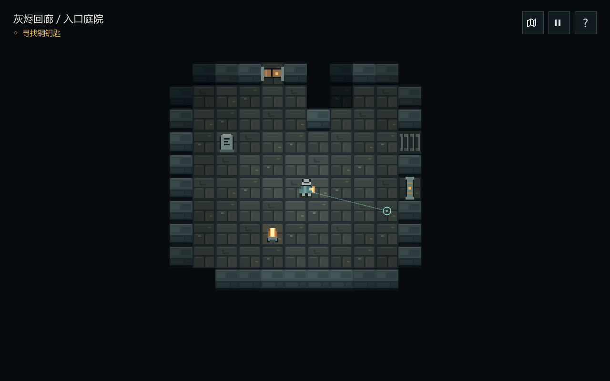

# CardRPG

Godot 4.7.2 .NET + C# 卡牌 RPG。首个可玩探索 Demo **「灰烬回廊」**已完成：在一座微型迷宫中寻找铜钥匙、打开回程捷径，点亮出口。支持键盘操作，也可全程仅用鼠标完成探索和菜单操作。



## 开始游玩

首次克隆请按[Demo 编译、运行与导出](doc/10_技术实现/06_Demo编译运行与导出.md)准备环境。Windows x64 导出完成后，双击 `artifacts/MicroMaze/CardRPG-MicroMaze.exe`。移动整个 `MicroMaze` 文件夹时，保留旁边的 `.pck` 和 `data_CardRPG_windows_x86_64` 目录。

从源码启动：双击根目录 **`Play-Demo.cmd`**，会自动编译并打开游戏。需要已安装 Godot 4.7.2 .NET、.NET SDK 10.0.401；Godot 路径通过用户环境变量 `GODOT4` 读取。

| 操作 | 鼠标 | 键盘 |
| --- | --- | --- |
| 移动 | 左键点击已探索地面的任意位置，按实际落点自由移动并绕开障碍 | WASD / 方向键，立即接管并取消鼠标路线 |
| 开关门、拾取、阅读、点亮出口 | 左键点击可见物件，自动靠近并交互；悬停时在物件旁显示操作提示 | E |
| 停止自动前往 | 场景中点击右键 | 按移动键接管，或打开地图 / 暂停 |
| 查看已探索地图 | 右上角地图图标，用“继续探索”返回 | M / Esc |
| 暂停 / 返回 | 右上角暂停图标，用“继续探索”返回 | Esc |
| 查看操作指引 | 右上角“?”，用“继续探索”返回 | F1 / Esc |
| 重新探索 | 暂停 → 重新开始 → 重新探索；“取消重开”保留当前进度 | R，确认后重置；Esc 取消 |
| 通关后重玩 / 退出 | 完成面板“重新探索”或“退出 Demo”；暂停中也可退出 | Tab 选择按钮，Enter 确认 |

场景铺满窗口，角色居中。左上角仅显示区域与当前目标，右上角收纳地图、暂停和帮助；取得钥匙或银币后才显示对应物品。起步提示在移动后消失，交互文字贴近物件且不拦截点击，操作反馈短暂显示后淡出。底部与右侧不再保留常驻说明面板。

鼠标移动不吸附格子中心，不限制四向或八向：空旷处沿任意角度直达点击位置，支持小于一格的微调，遇障碍自动绕行。圆形标记显示落点；点击紧贴墙面的地面时，会根据角色体积停在可站立的位置。

左键再次点击会从当前位置转向新落点。打开地图、暂停、帮助或重开会取消待执行的移动与交互，返回后保持停留。开门后点击门后的地面即可穿过；点击门本身用于开关门。无法到达或尚未探索的位置会显示提示，寻路不会自动开门或穿过未知地形。

先尝试庭院北面的木门。墙、拐角和关闭的门会挡住视线；栅栏可透视但不可穿过。地图保留已观察地形，钥匙和出口的位置需亲自探索。捷径门第一次需要从深处开启。

本阶段聚焦探索；卡牌战斗、敌人、存档与正式音效尚未接入。布局、视距和移动速度是 Demo 参数，后续可根据试玩调整。

## 开发与验证

完整环境配置、首次构建、自动验证及常见问题见[构建指南](doc/10_技术实现/06_Demo编译运行与导出.md)。以下命令在仓库根目录执行：

```powershell
# 编译全部项目
dotnet build CardRPG.sln
# 规则测试（无需启动 Godot）
dotnet test tests/CardRPG.Core.Tests/CardRPG.Core.Tests.csproj
# 打开 Godot 编辑器
powershell -NoProfile -ExecutionPolicy Bypass -File scripts/play.ps1 -Editor
# Windows Release 导出
powershell -NoProfile -ExecutionPolicy Bypass -File scripts/export.ps1
# 运行引擎内完整路线验证
& $env:GODOT4 --headless --path game -- --verify-demo
# 全鼠标操作验证（真实鼠标事件经过 GUI 与游戏输入处理）
& $env:GODOT4 --headless --path game -- --verify-mouse
```

VS Code 按 F5 可调试 C#，先重启 VS Code 以继承 `GODOT4`。正式工程入口是 `game/project.godot`，首场景是 `game/Scenes/MicroMaze.tscn`。

- `src/CardRPG.Core/`：与 Godot 无关的移动、碰撞、视野、地形记忆、交互状态和鼠标寻路。
- `game/Data/micro-maze.json`：35 × 25 的地图与图例，修改后重启游戏即可加载。
- `game/Scripts/`：TileMapLayer 像素场景、角色、界面和可选验证入口。
- `tests/CardRPG.Core.Tests/`：遮挡、穿墙、门锁、捷径、奖励与通关规则测试。
- `artifacts/`：本机导出包和验证输出，不纳入 Git。

本机使用 ANGLE / Direct3D 11 兼容渲染，已在 `project.godot` 中配置。像素图块和角色由代码绘制，界面使用系统中文字体，无额外美术资源下载。

## 项目资料

- [游戏设计概览](doc/00_游戏概览.md)
- [Demo 编译、运行与导出](doc/10_技术实现/06_Demo编译运行与导出.md)
- [开发环境、启动方式与验证记录](doc/10_技术实现/05_性能平台与发布构建.md)
- [微型迷宫 Demo 验收](doc/11_开发管理与验收/04_微型迷宫Demo验收.md)
