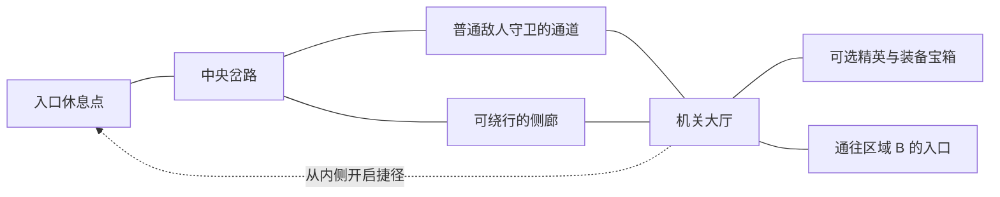

# 区域移动、战斗触发与场景交互方案

> 状态：移动与交互方案待确认；有限视野约束已同步 ｜ 更新日期：2026-10-08 ｜ 对应版本：待填写 ｜ 实现与试玩：未进行

建议采用**俯视角 2D 自由移动、场景明雷敌人、接触后进入独立卡牌战斗**。玩家在迷宫里观察路径与威胁，通过战斗、绕行、机关和捷径推进探索；角色成长与装备搭配决定战斗能力，并为部分场景交互提供不同解法。

探索压力主要来自连续战斗的血量损耗、路线选择和休息位置。采用这套方案需要制作可辨认的场景与碰撞布局，并处理探索和战斗之间的状态衔接。以下机制为建议，已确认的有限视野与遮挡约束在第 1 节列出；其他文档中的待定项尚未因此定案。

[返回游戏概览](../00_游戏概览.md) · [地图主规则](02_地图探索与关卡结构.md) · [遭遇与事件模块](03_遭遇事件与交互节点.md)

局部视野、遮挡、地形记忆及参考《黑暗之魂》三部曲的捷径与回访设计，集中维护在[视野遮挡与箱庭探索机制](06_视野遮挡与箱庭探索机制.md)。

## 1. 设计依据与适用边界

| 当前已确认的设计 | 对本方案的影响 |
| --- | --- |
| RPG 角色成长与地图探索是主要乐趣，剧情轻量 | 探索提供路线、收益和推进选择；交互以短提示和明确反馈为主 |
| 无职业；属性决定装备资格；穿戴装备组成卡组 | 战前准备围绕加点与换装；场景解法不设置职业专属条件 |
| 力量提升血量、敏捷提升速度、智力提升元素抗性 | 保留既有战斗成长；场景属性检定作为独立的候选用途，不能视为既有收益 |
| 每个角色回合抽 5 张、结束全弃；行动点回满、魔法点定额恢复并跨回合保留 | 地图行走不触发回合、抽牌或资源恢复；场景交互不依赖随机手牌 |
| 护盾默认在拥有者回合开始清除 | 不通过地图站立或走动模拟护盾回合；战间护盾处理另作建议 |
| 区域内箱庭迷宫、区域间较简单的网状连接，入口需探索发现 | 入口落在实际空间中；地图记录玩家发现的连接 |
| 探索保持有限可视范围，关闭房门后与拐角后不可见 | 敌人、交互和路线信息随实际视线逐步揭示；观察一个位置不揭开整个房间 |

角色人数、平台与联网方式尚未确定。本方案以本地单人原型说明暂停和交互行为；地图上控制一个探索代表，不据此决定战斗采用单角色还是队伍。如后续采用多人在线，需要重新设计暂停与交互占用规则。

依据：[角色定位](../02_角色与属性/01_角色定位与队伍.md)、[属性定义](../02_角色与属性/02_属性定义与计算.md)、[资源规则](../02_角色与属性/04_资源抗性与生存.md)、[牌区流转](../04_卡牌系统/03_抽牌手牌与牌区流转.md)。

## 2. 移动方式选择

| 方案 | 适合呈现的探索 | 操作与制作代价 | 本项目建议 |
| --- | --- | --- | --- |
| 俯视角自由移动 | 看见岔路、空间遮挡、敌人位置，走近并观察交互物 | 需要角色移动、碰撞与场景辨识；需控制追逐操作压力 | 推荐，便于表现箱庭空间 |
| 格子步进移动 | 每一步都涉及敌人同步移动或资源决策的迷宫 | 要增加地图步进、敌我同步行动与时间规则 | 若以后强调逐步推演路线，再考虑 |
| 房间／节点点击移动 | 在已列出的房间或事件间选择路线 | 路径输入简单，探索表达更多依赖节点信息 | 作为收缩制作规模的备选 |

### 推荐操作

- 采用俯视角八方向连续移动，移动方向不影响卡牌命中或战斗先后手。按键或摇杆映射随平台确定；键鼠原型可用方向键／WASD 加一个交互键。
- 基础移动速度统一，斜向与直线等速。敏捷提升的战斗属性“速度”不直接换算为地图移动速度，避免加点同时决定赶路和躲敌能力。
- 行走不消耗行动点、魔法点或额外体力；停留也不自动恢复血量或魔法点。探索阶段不运行战斗回合。
- 首轮原型提供移动和交互。冲刺、闪避、跳跃及地图攻击待基础探索体验验证后再评估。
- 角色、装备、地图和事件面板打开时暂停地图模拟；角色移动与敌人行为一同停止。关闭时回到原状态，不清除敌人的警戒记录。

视野由角色位置、距离与空间遮挡共同决定。推荐区分未探索、当前可见、曾见但当前不可见三种状态：保留已见地形和已确认入口的记忆，隐藏视野外的动态敌人和实时交互状态。开门仅露出门洞内可见部分，拐角后的内容随移动逐步出现。手动标记与“尚未开启”记录遵守同一信息边界；完整规则见[视野方案](06_视野遮挡与箱庭探索机制.md)。

发现入口建议分为两步：进入可见范围后识别入口物件并记录位置；靠近交互后揭示目的地、通行条件，并由玩家确认进入。走过门口不会自动切换区域。普通连接建议可返回，单向通道必须在进入前明确提示。

## 3. 战斗如何触发

### 明雷与遭遇类型

场景中的一个敌人标记代表一组预设遭遇，可能包含多个战斗单位；标记只在实际视野内显示，明雷不提前公开门后或拐角后的敌人。首轮原型以驻守敌人为主；短距离巡逻作为后续扩展，限制追击范围并提前提示警戒，避免将绕敌变成持续的反应速度考验。

| 遭遇 | 触发方式 | 玩家可以提前判断的内容 |
| --- | --- | --- |
| 普通驻守敌人 | 玩家进入与已显现敌人接触的有效范围，直接开战 | 实际视野内的外形与明显特征；未显现的同组成员不提前揭示 |
| 可选精英 | 靠近挑战位置，明确确认挑战后开战 | 可观察或通过线索得知的威胁与奖励类别；可先离开准备 |
| 关键守卫／首领 | 在清晰标识的门或挑战点交互确认 | 会进入关键战斗；确认前允许查看装备与卡组 |
| 事件战斗 | 选择已提示会引发战斗的选项后触发 | 战斗风险与已知代价；未知敌人细节可保留悬念 |

接触检测要求双方能够实际接触且不存在墙或关闭房门的阻隔。普通敌人先进入可观察范围，再触发接触战斗；开门本身不触发普通战斗。部分驻守敌人可以绕行，承担关键路线门槛的守卫则通过布局明确表达。门后或拐角处的敌人可配合声光、痕迹等线索制造未知风险，具体布置见[视野与接敌方案](06_视野遮挡与箱庭探索机制.md)。首轮原型建议不采用走路随机遇敌或地图先手攻击奖励。

巡逻若加入，采用“巡逻—警戒提示—有限追击—返回”的简单过程。成功脱离只能取消追击，不能领取战斗奖励或清除守卫；战斗开始后采用下文的战斗流程。

### 探索与战斗的交接

1. 满足触发条件后锁定本次遭遇，停止地图模拟，关闭普通交互并固定参战装备与卡组。重复接触只产生一场战斗。
2. 进入独立战斗界面，保留迷宫位置与该遭遇的关联。其他场景敌人不在战斗过程中临时加入。
3. 按穿戴装备及无武器默认牌规则建立本场卡组。建议初始手牌为空、整副牌洗入抽牌区；首个角色回合按既有规则抽 5 张，不额外抽一次开局手牌。
4. 战斗继续遵守已确认的资源与牌区规则。速度如何参与排序、队伍如何行动、回合开始各效果的顺序仍由[战斗流程](../05_战斗系统/01_战斗流程与行动顺序.md)确定；地图接触方向不赋予额外回合。
5. 获胜后完成奖励结算，记录该遭遇被击败，再返回原场景的安全落点。清除移动输入，避免结算关闭后立即撞上其他敌人；相邻遭遇的触发范围不重叠。

建议战斗内锁定装备，构筑调整放在战斗外。普通探索状态允许换装；进入警戒、追击、战斗或结算后只允许查看。面板暂停不改变是否允许换装的判定。新装备可立即比较其属性、提供卡牌及张数，再决定是否满足需求并穿戴。

首轮原型建议不提供战斗中撤退，玩家在触发前选择是否绕行或返回。若试玩表明误入战斗或卡关代价过高，再补充有明确代价与返回保护的撤退规则。

## 4. 连续探索的资源与休息

推荐采用“血量跨战斗保留，魔法点按战斗初始化”的组合。这样，路线与休息位置决定一次能深入多远，魔法牌的积累和使用主要在单场战斗中权衡。代价是战间魔法管理较轻，探索压力需要通过血量、遭遇和收益分布来验证。

| 状态 | 推荐战间规则 | 对玩家决策的作用 |
| --- | --- | --- |
| 当前血量 | 战斗结束保留，不因走动或等待恢复 | 判断继续探索、绕行或回到休息点 |
| 行动点 | 仅用于战斗；按角色回合恢复到上限 | 地图行走不会挤占出牌资源 |
| 魔法点 | 每场战斗以统一的初始值 M0 开始；具体值待测试 | 不必通过弱敌拖回合为下一场蓄满魔法点 |
| 护盾 | 普通护盾战斗结束清除，下一场默认从 0 开始 | 战前准备集中在成长和装备，避免保留上场护盾 |
| 手牌、抽牌区、弃牌区 | 每场战斗重新建立，不跨战斗保留顺序或手牌 | 新一场战斗正确使用当前穿戴装备提供的卡牌 |
| 临时状态 | 按战斗结束清除；跨场景效果必须单独标注 | 地图停留不代替回合推进或持续伤害结算 |

M0 指首次角色回合恢复前的值；首回合仍只执行一次既定资源恢复步骤。这是战斗初始化的候选规则，不改变魔法点跨回合保留的既有设计。战斗中若有治疗或长期收益效果，还需在相关卡牌规则中检查拖延弱敌获取无上限收益的问题。

### 休息与刷新

以探索段落的起点或关键支点设置安全休息点，并通过从深处开启的捷径连接它们，具体数量与间距通过试玩决定。**激活**只登记返回点和地图标记；玩家另行选择**休息**，确认后恢复血量，并刷新已访问区域的普通敌人。界面在确认前说明会刷新敌人。

普通敌人每次刷新后可重新挑战；首领、一次性精英、宝箱、机关、入口发现与已打开捷径保持完成状态。单纯跨区域、打开菜单或正常读档不会刷新已击败敌人。敌人刷新后的重复奖励需要经济模块定义，可先采用同一遭遇每轮刷新只结算一次的原型规则。

失败建议回到最近激活的休息点、恢复血量，并按休息规则刷新普通敌人；初始区域提供默认返回点，避免尚未激活营地时无处返回。保留此前已提交的成长、物品和探索进度，本次未获胜的战斗不发奖励。该温和失败方案主要损失重新推进的时间，具体惩罚可在试玩后调整。

血量上限因换装或成长变化时，原型建议采用 `新当前血量 = min(旧当前血量, 新血量上限)`，提升上限本身不补血，防止反复换装恢复血量。正式取值规则需同步到属性与装备模块。

## 5. 场景交互与角色成长的连接

可见交互物通过轮廓、动作或简短文字提示用途；走近后显示一个主要操作。多个物件重叠时突出当前目标，并允许切换目标。遮挡后或视距外的物件不通过轮廓、鼠标悬停或交互键泄露信息。通常用一次交互完成查看；消耗稀缺物品、休息刷新、触发关键战斗或跨区域时再给出可知结果的预览与确认。

| 交互类型 | 推荐行为 | 对探索与构筑的价值 |
| --- | --- | --- |
| 宝箱／遗留物 | 主动打开，显示获得物品及是否已领取 | 提供装备与成长资源的发现感；装备奖励可直接比较授予卡牌 |
| 门、拉杆、升降装置 | 改变路径；视野内显示变化，远处以声音或已知地标方向反馈 | 让玩家理解空间关系，打开回路或捷径 |
| 障碍与机关 | 提供属性解法和可探索获得的替代解法 | 加点体现不同便利，但各类构筑都能继续推进 |
| 危险地形／陷阱 | 有可观察线索，选择绕行、关闭或明确承担代价 | 提供风险选择；原型优先使用离散判定，避免连续碰撞反复扣血 |
| 休息点 | 激活、查看返回信息、确认休息 | 为深入探索与返回建立可理解的节奏 |
| 跨区域入口 | 记录发现，查看目的地与条件，确认通行 | 把迷宫内探索成果连接到大世界推进 |
| NPC／留言／石碑 | 短文本提供路线、世界背景或可选目标 | 支撑轻量剧情与空间线索 |
| 商人 | 在安全位置比较、购买或出售装备与物品 | 提供构筑调整机会；价格、货币与刷新另定 |

### 属性解法：让培养带来便利

建议在少量可选路径中使用确定性的属性门槛。下列都是新设计示例，阈值未定，不能将它们视为已有属性的自动效果。

| 场景示例 | 属性解法 | 不满足条件时的替代路线 |
| --- | --- | --- |
| 卡住的侧门 | 力量达到门槛，推开侧门获得捷径 | 通过附近房间绕到背面解除门闩 |
| 可拆除的机关 | 敏捷达到门槛，直接拆除 | 找到控制开关或绕过危险位置 |
| 标有符文的封印 | 智力达到门槛，理解符文并开启 | 探索取得符文说明或对应钥匙 |

探索检定建议读取初始属性加永久投入的点数，不计装备或临时加成；该口径独立于仍待确定的装备穿戴需求口径。若采用队伍，建议读取出战队伍中满足要求者，并明确显示由谁完成。显示条件与当前差距，不靠反复点击掷骰碰运气。

必经路径需要提供任何合法加点方向都能完成的替代解法；属性解法主要节省路线、代价或开启可选收获。不要让玩家为了继续主线被迫洗点。

“卡住的可选侧门”与“只能从另一侧开启的捷径门”分别配置。后者以找到深侧路径为解锁条件，按[门与捷径规则](06_视野遮挡与箱庭探索机制.md)设计，不能直接套用力量推门解法。

装备的探索用途可作为后续扩展，例如某件装备明确授予“点燃”交互能力。它需要独立配置与提示，不从战斗卡牌名称自动推断，也不要求探索时先随机抽到某张牌。首轮原型建议先验证普通交互和属性解法。

### 条件、消耗与结果

选择前展示确定的成本、可知的结果与未知风险；条件不足时说明原因且不扣费。确认时再次检查条件，将消耗、路径变化和奖励生成作为同一次完成结果记录。奖励领取单独记录，背包无法容纳时保留待领取状态。一次性物件完成后显示已开启／已解决，重复交互不再扣费或生成奖励；已领取的奖励不再发放。若交互尚未提交，则允许无消耗取消。

地图与存档需要共同保存入口发现、门和捷径、交互完成状态、敌人刷新与击败状态、待领取奖励、返回点及角色当前血量。战斗中退出后的恢复方式仍待定，不能用重新初始化战斗代替恢复已保存的战斗状态。

## 6. 一段区域路线示例

以下是验证方案的小型样例，节点代表实际场景中的空间；数量不代表正式内容规模。

玩家从入口出发，先观察视野内的岔路和已经显现的普通守卫，再决定挑战守卫或试探侧廊；遮挡后的路径与敌人不会随这张设计图提前公开。侧廊设置机关：满足敏捷门槛可以直接处理，不满足时可寻找侧廊内的开关；两者最终都能到达大厅。

大厅允许从内侧打开返回入口休息点的捷径。此时玩家根据剩余血量选择挑战可选精英、带着已获得装备返回休息，或继续寻找通往区域 B 的入口。装备奖励按当前属性判断能否穿戴；可穿戴时查看卡组变化，需求不足时成为后续成长目标。

进入新区域前先交互查看目的地与条件，再确认通过。世界地图新增该次实际发现的连接；即使未挑战精英或打开其宝箱，也可以发现区域入口。

## 7. 原型顺序与验收

建议先做一个包含上述路线的小型探索原型；这是验证范围建议，正式首版规模仍由[首版范围与内容规模](../01_游戏定位/03_首版范围与内容规模.md)确定。

1. 先验证自由移动、碰撞、视野遮挡、交互选择与地图发现，确认岔路和入口在实际可见时可辨认。
2. 接入驻守敌人的战斗切换、装备卡组初始化、胜利返回和一次性奖励结算。
3. 加入血量继承、休息刷新、失败返回，以及一个机关、一条捷径和一个跨区域入口。
4. 完成基础循环试玩后，再评估巡逻、商人、装备探索能力与快捷传送的必要性。

| 检查 | 预期行为 | 状态 |
| --- | --- | --- |
| 不同敏捷角色走同一路线，直行或斜行 | 基础移动速度一致；行动点和魔法点不随行走变化 | 未验证 |
| 开门、越过拐角、离开已探索房间 | 按实际视线逐步揭示；离开后只保留地形记忆，动态信息隐藏；详细检查见视野方案 | 未验证 |
| 敌人与玩家隔墙，或同一敌人被连续接触 | 隔墙不触发，连续接触只进入一次战斗 | 未验证 |
| 无武器或刚更换装备后进入战斗 | 按当前装备与默认牌规则建立卡组；首回合只抽 5 张 | 未验证 |
| 追击中打开装备面板再关闭 | 地图暂停后继续追击；打开面板不能清除警戒或绕过换装限制 | 未验证 |
| 两场连续战斗 | 血量继承，魔法点按 M0 初始化；护盾和牌区按本方案重置 | 未验证 |
| 激活休息点、跨区或普通读档 | 不因这些行为刷新敌人；主动休息才恢复并触发刷新 | 未验证 |
| 休息刷新、失败返回后回访宝箱与捷径 | 普通敌人按规则刷新；已领取宝箱与已打开捷径保持状态 | 未验证 |
| 力量、敏捷或智力不满足场景门槛 | 能从明确线索找到替代解法，必经路线仍可完成 | 未验证 |
| 换装导致血量上限升降、事件条件变化或背包已满 | 不凭空补血；提交前校验条件，奖励不会重复或丢失 | 未验证 |

试玩重点观察玩家能否解释自己的路线选择、发现入口的过程、换装带来的打法变化，以及返回休息是否成为频繁重复的负担。若选择过少，优先调整路径、机关和收益分布；若移动操作负担过高，先降低追逐与碰撞要求。

## 8. 采用前需要收敛的事项

| 事项 | 本方案建议 | 尚需确定 |
| --- | --- | --- |
| 移动与输入 | 俯视角八方向自由移动 | 目标平台、具体视角和按键布局 |
| 单角色或队伍 | 一个探索代表，战斗人数另定 | 角色数量、队伍构筑与属性检定主体 |
| 战斗资源 | 血量继承；魔法点每场初始化；普通护盾清除 | M0、恢复与结算顺序、状态例外 |
| 休息与失败 | 激活和休息分开，休息刷新普通敌人，失败返回休息点 | 恢复范围、重复收益与实际推进成本 |
| 场景属性检定 | 永久投入属性提供便利，必经路线提供替代解法 | 具体门槛、替代路线与提示 |
| 战斗前后衔接 | 战斗内锁定装备；战外非警戒时可换装 | 战斗中退出／读档、后续是否增加撤退 |

有限视野与遮挡要求已经同步到主文档。其余机制确认采用后，再把有关移动、资源、装备、遭遇、界面和存档的细节同步到其主文档；本页保留为整体方案，便于比较和调整。
