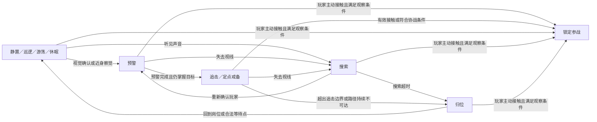

# 迷宫怪物行为、索敌与多怪接战

> 状态：设计草案，待原型验证 ｜ 更新日期：2026-10-09 ｜ 实现状态：尚未接入 Demo

建议采用**静置守点与有限移动并存、感知后先预警、有效接触或完整远程瞄准或玩家主动出击完成后开战、开战瞬间一次确定全部参战者**。玩家可以观察朝向和巡逻间隙，利用拐角、房门与距离拆开敌群；多怪战斗来自同一片可接战空间中的实际威胁，不能隔墙拉入整间房，也不在卡牌战斗进行中追加地图敌人。

普通怪物建议一只地图实体对应一个战斗单位。多只怪物可以属于同一小队，但每只独立判断感知、追击和参战资格。这样能直观表达引开巡逻、逐个解决与同时迎战的区别，代价是需要维护各个体的状态和一次合并遭遇的记录。首领及事件使用明确的挑战入口和预设编组。

[返回游戏概览](../00_游戏概览.md) · [移动与战斗衔接](05_区域移动战斗与交互方案.md) · [视野与遮挡](06_视野遮挡与箱庭探索机制.md) · [战斗内敌人行为](../05_战斗系统/05_敌人行为与首领机制.md)

## 1. 适用边界与已有基础

本方案基于本地单人、一个地图探索代表及独立卡牌战斗，不决定战斗采用单角色还是队伍。地图感知和等待使用探索时间，不产生抽牌、行动点恢复或额外战斗回合。

当前 Demo 已有自由移动、遮挡、房门、地图记忆和鼠标寻路，尚无怪物与战斗。现有代码中玩家移动速度为 `3.25 格/秒`、视距为 `6.5 格`、碰撞半径为 `0.23 格`，见 [MazeSession.cs](../../src/CardRPG.Core/MazeSession.cs)。本文其他数值均为建议的首轮调试值，不是实测平衡结论；“格”仅为距离单位，角色仍连续移动。

本提案细化并调整此前草案的两处约定：普通遭遇从“一个标记代表整组”改为逐个实体参战；相邻普通遭遇从“触发范围不重叠”改为允许合并，但必须遵守第 5 节。挑战入口仍可代表整组。其余有限视野、开门不直接开战、战斗期间冻结地图的约束继续有效。

后续的[远程怪物补充方案](08_远程怪物行为与开战.md)增加瞄准完成后的远程触发，取代此前所有普通怪物必须接触的限制；地图上仍不结算攻击伤害。远程射程、瞄准、射击遮挡与有限退让集中维护在该页。

[玩家主动出击与先攻优势](09_玩家主动出击与先攻优势.md)进一步加入玩家完成请求、装备供牌授权的开战技及首轮顺序优势；普通碰撞不自动等于玩家先攻。玩家所选目标即使未完成自己的预警，也可因被主动出击而直接参战，其他怪物仍需各自满足资格。

## 2. 怪物怎样分布和移动

怪物的**日常移动方式**与**受惊后的反应**分别配置。静置只说明平时站定；明确标为“定点”的怪物被发现后仍不离开岗位。下列名称为灰烬回廊的内容示例，属性、技能与掉落另行配置。

| 原型 | 日常行为 | 索敌与受惊反应 | 布置用途与玩家应对 |
| --- | --- | --- | --- |
| 灰甲守卫 | 静置，固定面向；可配置原地缓慢转向 | 正面视觉与近身察觉；预警后短距离追击 | 守通道或宝箱，允许从背侧绕行或引离岗位 |
| 缚地石像 | 定点静置，始终不移动 | 全周近距离感知；预警后保持接战姿态 | 提供位置稳定的路线门槛；靠近才战斗，不在地图上远程攻击 |
| 提灯巡卒 | 沿明确路点往返，端点停顿 | 正面视觉为主；预警后追击，脱战后回最近可达路点 | 创造通过时机；灯光只作可见线索，不穿墙显示实体 |
| 嗅灰兽 | 在所属小范围游荡，移动与停留交替 | 较宽视觉、脚步听觉；先查探声源，再确认目标 | 让局部安全窗口变化；玩家可停步、绕远或利用门阻隔 |
| 蜷伏尸 | 静置休眠，有轮廓或呼吸等线索 | 近距离或指定响声唤醒；起身预警后短追 | 用于支路伏击；不得首次显现即伤害玩家或强制开战 |
| 鸣钟哨兵 | 静置或短巡逻 | 确认玩家后发出一次报警，使附近同伴搜索 | 让玩家选择尽早接战或把它引离同伴；报警本身不拉人入战 |
| 封门精英／首领 | 留在挑战位置 | 通过有风险提示的交互确认开战 | 独立挑战，不响应普通怪物的报警或合战 |

首轮先验证守卫、石像、巡卒和蜷伏尸；嗅灰兽与哨兵作为同一规则上的后续内容。正式数量和名称尚未确定。

### 移动约束

- 巡逻采用固定路点，游荡只在预先划定的活动区选择可达落点；不能为跟随玩家而改变巡逻路线或随机传送。
- 追击必须同时受所属活动区和离巢最远路径距离限制，取更严格者。活动区可以包含相连房间，但不能包含休息点安全区或跨区域入口后的地图。
- 普通怪物不会开门、穿门、穿墙、穿越栅栏或跨区追击。开着的普通门可通过；关门立即使受影响路径失效。门洞被任一角色碰撞体占用时不得关门。
- 怪物之间保留体积，狭窄通道中排队或等待，不能互相穿过抢到玩家身边。归位路径被门堵住时，在本侧最后可达处等待，不瞬移回家。
- 巡逻或游荡遇到堵路先等待、再选择本活动区内合法路径；没有路径就留在原地。视野外的活动继续模拟，但不显示实时位置或标记。
- 地图上的碰撞只用于挡路和接战，不直接扣血。“射手／法师”等战斗定位不会自动赋予地图远程开战能力；配置启用后，才按[远程方案](08_远程怪物行为与开战.md)站定瞄准并提交接战请求。

## 3. 怎样发现玩家，怎样失去目标

### 三种感知入口

| 感知方式 | 成立条件 | 得到的信息与后续行为 |
| --- | --- | --- |
| 视觉 | 同一层、在视距及视角内、到玩家的视线未被遮挡，持续达到确认时间 | 进入预警并记录玩家最后可见位置；墙和关闭的门阻断视觉 |
| 近身察觉 | 玩家处于较小全周范围，且局部无墙、门、栅栏阻隔 | 无视面向进入预警，防止贴身绕背仍完全无反应；仍需满足接战条件 |
| 听觉 | 有实际声音事件，经声学通路衰减后仍在该怪物听距内 | 只记录声源发生时的位置，进入搜索；不能取得玩家实时坐标或直接开战 |

感知和玩家是否看得见怪物分别计算，二者共用同一套真实墙、门与楼层状态。普通敌人的视觉范围不大于玩家基础视距；透明栅栏可以让双方看见，仍会阻止接触。敌人朝向由实际移动、定点转向或已获知的声源决定，不能背对玩家时因读取其坐标瞬间转身。

视觉确认时间必须连续积累；丢失视线即清空尚未完成的确认进度。已有目标的敌人丢失视线后只前往最后已知位置，不透视追踪。重新看见玩家后才能更新追击目标。

首轮声音只接入开关门、指定机关和报警；普通行走不自动产生 AI 可听事件。嗅灰兽加入时再启用明确的脚步规则：移动时按步频发声、站立停止，避免依赖玩家猜测隐藏的潜行按键。声音绕拐角按声学路径传播；实墙阻断、关闭木门衰减，密封门阻断。声学通路与可走通路独立，听见门后响声也只能走到门前。具体听距与衰减通过原型配置，不预设全图广播。

报警只在哨兵一次警戒周期中发送一次；接收者记录报警时的目标线索并搜索，不立即获得持续锁定，也不转发报警。只有独立确认玩家后才进入自身预警；避免一声报警递归唤醒整个区域。

### 接触型怪物的行为状态

下图描述接触型怪物；远程类型在发现目标后进入有限找射位与站定瞄准流程，见[远程状态图](08_远程怪物行为与开战.md)。

预警用抬头、起身、举武器和可见的感叹提示表达。预警期间怪物停止向玩家靠近，给出一次可辨认的反应窗口；休眠怪物先完成起身，才允许移动或主动接战。搜索使用问号或查探动作，声音线索不得显示隐藏怪物的数量和坐标。

追击中失去视线就转搜索，在最后已知位置附近有限查探，超时归位。定点怪物只原地观察，不因搜索离岗。到达追击边界或路径持续不可达时也归位；归位途中忽略普通视觉和声音刺激，到岗位或合法等待点后才恢复日常索敌，但玩家仍可主动接触它开战，避免用归位状态穿过守卫。

“警戒”在界面和换装规则中包含预警、追击、定点戒备、搜索、归位，以及远程找射位与瞄准；只有关联玩家的全部怪物完成归位或被击败后，才解除该限制。与玩家无关的环境声搜索不锁玩家装备。打开地图或菜单会暂停所有移动和计时，关闭后继续原状态，不能靠菜单消除警戒。

## 4. 哪些条件真正触发战斗

### 普通接触

一次有效接触必须同时满足下列条件：

1. 当前处于探索状态，怪物存活、可敌对、未被别的遭遇锁定；没有战后返回保护。
2. 玩家与怪物在同一区域、同一层，距离达到接触阈值；双方之间的短接触通道能容纳碰撞体，没有墙、关闭门或栅栏。直线距离近或寻路绕一圈可达都不能单独证明发生接触。
3. 怪物当前对玩家可见，而且已连续处于可见状态至少一个观察窗口。丢失可见性会重置该窗口，但不重置怪物的警戒状态。
4. 若是怪物主动接近，必须完成预警及起身动作；若是玩家主动移动接近，可以在观察窗口结束后提前接战，无须再等怪物预警完毕。玩家主动靠近休眠怪物也不获得免费攻击或额外回合。

观察窗口未完成时，双方移动停在接触边界，不穿过对方、不暗中扣血。条件满足后，由持续的有效接近输入或怪物合法追击再次形成接触请求；单纯显示出怪物、开门或计时结束都不独立触发战斗。记录接触请求的发起方，不能把预警中尚未移动的怪物误判为主动攻击。

鼠标自动移动首次发现路线附近的预警敌人时取消当前路线与待执行交互，让玩家重新选择；玩家重新点击靠近可继续接战。键盘可松键后退，持续按住靠近则视为继续接战。场景首次显现和门口站位仍必须留出观察空间，不能仅依赖输入拦截补救全部不合理布局。

### 挑战和事件

首领、独立精英、事件战斗由有风险提示的交互确认触发，锁定其预设编组。普通追击者不混入挑战，挑战成员也不参加普通合战。有怪物针对玩家处于警戒状态，或本逻辑步已有合法接触／远程接战请求时，挑战入口、休息和跨区交互不可提交；普通接战优先，防止用弹窗和区域切换清除追击。普通开关门仍可使用。

挑战确认前可查看已知敌情和装备，确认后才锁定卡组；未知身份与技能不提前公开。接近方向、背后接触和伏击不改变既有首回合抽牌或资源规则。战斗内先手、行动顺序、撤退仍由[战斗流程](../05_战斗系统/01_战斗流程与行动顺序.md)定义，本提案不增加地图先手伤害。

## 5. 多只怪物如何进入同一场战斗

### 采用一次快照合并

| 方案 | 玩家体验 | 结论 |
| --- | --- | --- |
| 只打最先触发的一只 | 容易逐个处理，但其他已接触或完成瞄准的怪物会被忽略 | 不采用 |
| 接触后延迟收集，或战斗中持续增援 | 能表现持续围攻，但玩家难以预判规模，与地图暂停冲突 | 普通遭遇不采用 |
| 同步收集接触与远程请求，再加入当下具备资格的近处敌人 | 玩家能通过位置拆分敌群，开战后名单稳定 | 推荐 |

在同一地图逻辑步中，从共同的步初状态计算全部移动意图，统一处理门状态、移动冲突和感知，再收集接触请求，不能由某个怪物的碰撞回调抢先打开战斗。移动需要扫掠检测并阻止越过接触边界；先到边界的单位停止本步的接近位移，再从共同结果检查全部接触者。共享狭窄落点等冲突按稳定实例 ID 裁决，不能依赖对象遍历顺序。

把本步满足第 4 节的全部普通接触者、按[远程方案](08_远程怪物行为与开战.md)完成瞄准且复核通过的怪物，以及[玩家主动出击](09_玩家主动出击与先攻优势.md)成功选定的目标合并，记为 **D（直接触发集合）**。`D` 非空时只创建一场普通战斗，所有成员必须参战；同一怪物的多次碰撞、多个检测点或多种请求按实例 ID 去重。门、移动、射线及计时在同一快照中处理；额外记录玩家完成、敌方完成和普通接触的原因，用于首轮顺序判定。

接着检查附近怪物是否进入 **S（协战候选集合）**。启用远程接战的怪物不经此路径跳过瞄准，它须通过实际接触、完整瞄准或成为玩家成功出击的目标进入 `D`。一只未直接触发、采用地图接触方式的怪物必须同时满足以下条件：

- 与 `D` 至少一只属于同一敌对阵营；当前可战斗，未锁定，且配置允许协战。首轮普通怪物使用一个敌对阵营，小队 ID 仅用于布置与报警关系，不赋予自动入战资格。
- 当前处于追击或定点戒备，已完成自身预警；休眠、预警未结束、仅听声搜索和归位者均不因“附近有战斗”自动参加。
- 它当前能直接看见玩家，且也处于玩家当前可见范围，已满足同一个观察窗口；不能把拐角后、门后或刚露头的援兵直接塞入名单。
- 按当前障碍、怪物体积及活动区，走到玩家接触边界的最短可行路径不超过协战距离；不跨关闭门、栅栏、追击边界、安全区或楼层。定点怪物以同样的空间检查判断能否协战，但在地图上保持原地。

协战距离统一从怪物到玩家计算，不从“已经加入的怪物”向外扩散。**所有候选只判一次，不递归传染**；报警和小队关系不能覆盖可见、状态、距离和通行条件。同一个房间、同一个小队或欧氏距离很近，都不足以单独加入战斗。

常规战斗目标为最多 `4` 个敌方单位，先容纳 `D`，再按“到玩家的可行路径短者优先，距离相同时按稳定实例 ID”从 `S` 补齐。这里的 4 是首轮内容与协战上限，不允许用它漏掉已直接触发的怪物：若 `D` 已有 5 只，则这 5 只全部参战、不再补入协战者，同时记录布置告警。实现必须支持展示全部直接参战者；若战斗界面只能容纳 4 只，就必须先在布置、移动占位及远程触发层保证 `D ≤ 4`，不能静默丢弃第 5 只。

名单确定后生成一次遭遇记录并冻结地图，直至战斗和奖励结算结束；候选之外的怪物保持原位置与状态。没有“再等 0.5 秒看看谁赶到”的隐藏收集窗口，也没有战斗进行中才通过地图判定加入的援兵。以后若设计召唤技能，产生的是本场战斗单位，其规则独立于地图参战名单。

### 典型结果

| 开战时的空间和状态 | 结果 |
| --- | --- |
| A、B 同一步分别接触玩家，都满足观察条件 | `D = {A, B}`，创建一场双怪战斗，不各开一场 |
| 玩家接触 A；接触型 B 已完成预警，双方可见，合法路径在协战距离内 | B 加入同一场战斗，即使还没碰到玩家 |
| 接触型 B 与 A 同队，却在关闭门后或同屏栅栏另一侧且没有短可行路径 | B 不加入；同队、可见或直线距离近都不够 |
| B 在拐角后听见报警，正在搜索 | B 不加入；即使稍后会赶到，名单也已冻结 |
| B 离玩家足够近，C 只离 B 足够近 | 分别从玩家计算；B 可以加入，超出协战距离的 C 不加入 |
| 玩家引走 A，B 留在岗位且已超出协战距离 | 只与 A 战斗，拆分敌群成立 |
| B 在范围内但预警尚未结束，或刚进入玩家视线 | B 不加入；留在地图上，战后按第 6 节恢复 |
| A 为普通怪物，旁边是有确认入口的精英 | 普通战斗只计算普通怪物，精英继续保留挑战入口 |
| 2 只直接接触，另有 3 只合法协战者 | 直接接触的 2 只加距离最近的 2 只；剩余者不发奖励、不消失 |
| 玩家接触 A，同一步弓手完成完整瞄准 | 两者共同直接触发；未完成瞄准的其他射手不额外加入，细则见远程方案 |

界面在可见怪物已具备协战资格时显示简短的“可协战”标记，并在实际入场时突出所有参战者。标记是当前状态提示，尚未发生接触时不保证最终名额；具体排序可能随玩家和怪物移动改变。不得通过标记揭露隐藏目标或提示“墙后还有两只”。

## 6. 战斗结束后如何回到迷宫

胜利只清除锁定名单对应的地图怪物。掉落按参战实例及本轮刷新记录结算，不能因同队成员落败而清除或奖励未参战者。合并遭遇使用 `遭遇 ID + 怪物实例 ID + 刷新轮次` 关联奖励；怪物击败、奖励生成与领取状态需要一致提交，防止退出重进重复结算。

返回优先使用开战前的玩家位置，并检查怪物占位、墙体和触发边界；不安全时，沿最近合法来路退到本次接敌前预先记录的安全点，不跨墙、门或未走过的空间传送。没有合法返回点的布置应在关卡校验中报错；运行时若遇到这种异常，保持地图暂停并提示恢复失败，不能强行重叠生成玩家。

清空键盘移动状态、鼠标路径和待执行交互；仍按住的旧移动键必须先松开再按下才重新生效。给予一个短暂返回保护期：未参战怪物保持冻结，玩家可观察和后退，普通接触不触发；保护期间禁止靠怪物身体穿行、换装、休息、跨区或确认挑战。保护按探索时间计时，打开菜单会一同暂停。结束后剩余怪物继续冻结前的状态、目标记忆及剩余计时，不因玩家胜利而统一归位；同时重新累计接战所需的可见观察窗口，怪物主动靠近还要经过一次重新预警，避免贴身剩余者立刻开启下一战。期间玩家主动继续接近，可在保护与观察窗口均结束后接战。

远程怪物在返回保护期间同样不能瞄准或开战，其旧瞄准进度清零；保护结束后重新完整瞄准，替代普通重新预警。位置、警戒与目标记忆仍保留，详见[远程返回规则](08_远程怪物行为与开战.md)。

失败、主动休息和刷新继续引用[移动与资源方案](05_区域移动战斗与交互方案.md)：普通怪物按刷新轮次恢复，首领、一次性精英和已领取的稳定探索进度分别处理。普通读档、菜单和跨区不视为刷新；保存状态需要包含怪物实例、位置、行为状态、最后已知位置和计时，读档后重新计算可见性，不能据地图记忆直接显示或接战。战斗中保存的具体方案仍待技术设计确定。

## 7. 首轮参数与布置要求

以下数值用于建立可玩原型，均可配置并等待试玩；不将战斗属性“速度”直接乘到地图速度上。

| 参数 | 建议起点 | 使用边界 |
| --- | --- | --- |
| 普通视觉 | 4.5 格，正面 120° | 嗅灰兽可先试 180°；定点石像为 2 格全周 |
| 近身察觉 | 1 格，全周 | 仍受局部实体阻隔 |
| 视觉确认／预警 | 0.2 秒／0.8 秒 | 分别控制认出目标与允许主动追击，不相互替代 |
| 玩家观察窗口 | 连续可见 0.6 秒 | 普通直接接触和协战均检查；暂停不累计 |
| 怪物普通碰撞半径 | 0.23 格 | 大体型另配，所有路径与门洞检查使用实际体积 |
| 接触距离 | 双方碰撞半径之和 + 0.15 格 | 必须同时通过局部可接触检查 |
| 巡逻／游荡速度 | 玩家基础速度的 45%／35% | 端点或游荡落点停留 1～2 秒 |
| 普通追击速度 | 玩家基础速度的 80% | 首轮不给必然追上玩家的持续高速怪物 |
| 离巢追击距离 | 从岗位计的可行路径 6 格 | 与活动区共同限制；巡逻路线也需包含在合法范围内 |
| 失去视线后的搜索 | 2 秒 | 到达最后已知点后在 1 格范围查探；另设总计 4 秒硬超时，防止一直赶路 |
| 路径持续不可达 | 1 秒后归位 | 期间不更新为玩家的隐藏位置 |
| 协战距离／常规人数 | 到玩家接触边界的可行路径 3 格／4 只 | 4 只只限制补入协战者，所有直接触发者必须保留；远程射程另配 |
| 战后返回保护 | 1.5 秒 | 保护结束后重新预警；不恢复血量或战斗资源 |

关卡布置应满足：普通敌人首次可能被看见的位置，与接触边界之间留出按玩家最高地图速度测算的观察空间；敌人不站在开门落点、狭窄门洞或出口生成点上。单只守卫教学区避免其他协战者干扰；多怪教学区先展示两只可见敌人的联动，再用可引离的巡逻队验证拆分。

建议验证路线：入口外的定点石像学习接触规则 → 转角后的静置守卫学习预警与退后 → 一条有旁路的巡逻走廊学习观察时间窗 → 开阔小厅内的守卫与巡卒学习双怪合战及引离 → 有明确线索的蜷伏尸学习伏击 → 独立精英挑战入口。该路线为新增原型内容建议，不代表已修改当前 Demo 地图。

## 8. 实现接口与验收

在独立规则层维护怪物状态与一次遭遇名单，Godot 负责表现和输入。不要用节点进入范围的单次回调直接启动战斗，也不要用“当前是否绘制”代替规则层的可见性。玩家不移动时怪物和计时仍需更新；现有 `MazeSession.Tick` 在玩家方向为零时提前返回，接入 AI 时需先拆出独立的探索模拟推进。

| 数据 | 最少需要表达的内容 |
| --- | --- |
| 怪物配置 | 稳定配置 ID、战斗单位引用、日常移动方式、警戒反应、感知参数、体积、地图接战方式、是否允许协战、刷新策略；远程扩展见专页 |
| 地图实例 | 实例 ID、区域／楼层、阵营与可选小队 ID、岗位、巡逻路点、活动区、挑战入口归属 |
| 运行状态 | 位置／朝向、行为状态、目标来源、最后已知位置、感知／预警／搜索计时、连续可见时间、报警是否已发送、存活及刷新轮次；主动出击方案另记录本轮是否曾警觉 |
| 遭遇记录 | 遭遇 ID、直接触发者与协战者列表、接触／远程／玩家出击／协战原因、冻结快照、安全返回点、击败与奖励状态；首轮顺序与准备牌见主动出击方案 |

按“定点接触与返回 → 视觉预警和有限追击 → 巡逻、搜索与归位 → 同步接触与协战 → 听觉、报警和伏击”推进。下列为待实现验收，本文未执行游戏行为测试。

| 检查 | 预期结果 |
| --- | --- |
| 开门后原地等待，接触型敌人原本位于门侧 | 开门与观察本身不发起战斗；接触型敌人完成预警并实际接近才可能触发；远程类型见专页 |
| 玩家与接触型敌人隔墙、隔关闭门、隔栅栏，碰撞距离很近 | 不直接接战；栅栏另一侧若无足够短的合法路径，也不协战；可穿射障碍的远程触发另行检查 |
| 怪物听见门后机关；玩家在门后改变位置 | 怪物只搜索原声源，不跟随隐藏坐标；不开门、不隔门开战 |
| 转角首次遇到敌人，或休眠怪物起身 | 观察与预警有可辨认窗口，无地图伤害、无额外首回合 |
| 玩家站立不动；分别以键盘和鼠标进入遭遇 | 怪物仍按探索时间运行；两种输入使用相同接战条件，鼠标预警会取消旧路线 |
| 追击时关门、走出活动区或打开菜单 | 关门重算路径，超界归位；菜单暂停并保留状态与换装限制 |
| 怪物归位时玩家经过，回程被门堵住 | 不穿人、不穿门、不传送；合法主动接触仍能开战 |
| 两只怪物同一逻辑步接触，交换实例遍历顺序 | 始终仅一场战斗，直接接触名单相同且没有重复单位 |
| 邻近协战、拐角援兵、跨门同队及链式站位 | 分别符合第 5 节例表；只查一次候选，没有递归拉怪 |
| 2 只接触与 3 只协战候选；或 5 只同时接触 | 前者选满 4 只且排序稳定；后者保留全部 5 只并告警 |
| 战斗中等待很久，或多次碰撞回调到达 | 其他地图怪物不移动、不临时加入；仅一个遭遇 ID |
| 胜利后仍有贴身未参战者，持续按移动或保留旧鼠标路线 | 不自动连战；清输入、返回保护及重新预警生效，只移除并奖励实际参战者 |
| 报警、读档、重复提交奖励、休息刷新 | 报警不转播、不越权接战；读档不清警戒或复制奖励，休息刷新轮次可区分 |

需要试玩收敛的重点是观察窗口是否足够、玩家能否理解协战名单、拆分敌群是否过于容易，以及剩余敌人的战后重新预警是否自然。敌人战斗属性、具体技能、首领阶段、战斗内行动顺序和正式存档恢复仍由各自模块决定。
