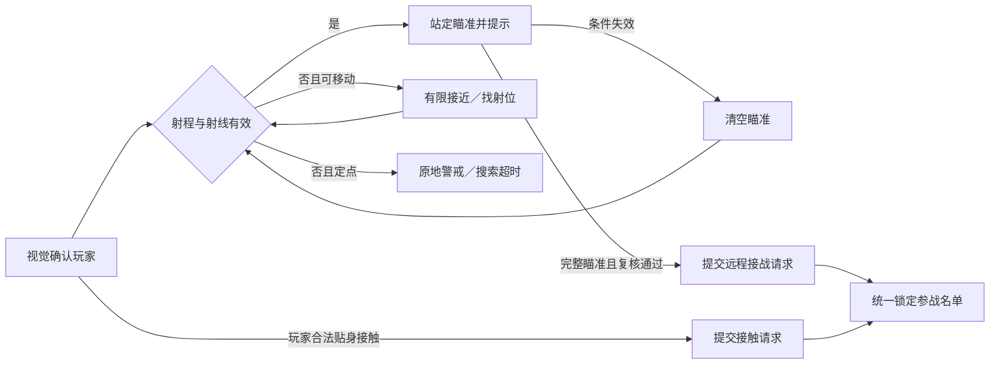

# 远程怪物行为与开战

> 状态：设计草案，待原型验证 ｜ 更新日期：2026-10-09 ｜ 实现状态：尚未接入 Demo

建议远程敌人通过**站定瞄准、持续满足射击条件、瞄准完成后进入卡牌战斗**主动接战。玩家可以退到掩体后、关门、退出射程或主动贴近。地图阶段不结算箭矢或法术伤害，不给予远程敌人免费攻击；首次顺序按[玩家主动出击与先攻优势](09_玩家主动出击与先攻优势.md)的补充规则调整，仍只执行正常回合与卡牌结算。

这为[怪物接战方案](07_迷宫怪物行为与多怪接战.md)增加一种接战方式，替代其中此前“所有普通怪物只能通过接触开战”的限制。日常静置或移动、有限追击、观察窗口、地图冻结和战后保护仍沿用共同规则。代价是需要新增瞄准反馈、射击遮挡与统一的远程接战请求。

[返回游戏概览](../00_游戏概览.md) · [怪物共同规则](07_迷宫怪物行为与多怪接战.md) · [视野与遮挡](06_视野遮挡与箱庭探索机制.md) · [战斗流程](../05_战斗系统/01_战斗流程与行动顺序.md)

## 1. 地图上怎样行动

“能用远程卡牌”与“能在地图上远程开战”分别配置；拥有投掷技能的普通守卫可以继续采用接触方式，专门的弓手、炮台和法师再启用远程接战。

| 类型 | 平时行为 | 发现玩家后 | 玩家应对 |
| --- | --- | --- | --- |
| 定点弩手／符文炮台 | 留在固定位置，面向主要通道 | 有合法射线就站定瞄准；目标被遮挡时原地警戒，超时恢复 | 借掩体穿过通道，或接近解决固定威胁 |
| 巡逻弓手 | 沿路点巡逻 | 停步瞄准；射程不足时有限接近，失去视线后搜索最后已知点 | 观察巡逻方向，引到转角或拆开同伴 |
| 游走法师 | 在小范围停留或移动 | 寻找附近可用射位；施法预警期间站定，不能移动蓄满后突然释放 | 遮挡施法、抢先贴近或退出其活动区 |

移动射手的接近、绕障和退让都遵守原活动区、离巢距离与不可开门规则，不为恢复射线追遍地图。寻找射位只使用已观察到的玩家位置；失去视线后不读取玩家实时坐标。定点射手没有行走能力，即使路通也不离岗。能保持合法射线时，不因到玩家的行走路径不可达而归位；只有需要走位且持续找不到合法射位时，才使用共同规则的不可达超时。

可给移动射手一个偏好的作战距离，例如 `2.5～4.5 格`。玩家靠得过近时，只允许在一次警戒周期内后撤一次、最多 `1 格`；退路必须可达且不穿人、不越边界。后撤发生在瞄准开始前，后撤时不积累瞄准；已经瞄准就留在原地。无退路时原地应战，不持续绕圈逃跑。首轮不设置禁止近距离射击的最小射程，玩家贴身则按普通接触提前开战。

单纯贴身不自动给法师加沉默、给弓手加伤害惩罚或让玩家先手。玩家明确完成开战技时，可以按[主动出击方案](09_玩家主动出击与先攻优势.md)争取顺序、准备牌与破势机会；打断仍需在战斗中实际付费出牌，且目标意图必须可打断。

## 2. 什么条件允许远程开战

### 三个范围分别判断

| 范围 | 决定什么 | 首轮建议 |
| --- | --- | --- |
| 感知范围 | 怪物能否发现玩家 | 远程怪物先试 5.5 格，仍不超过玩家 6.5 格基础视距 |
| 地图射程 | 能否开始并维持瞄准 | 先试 4.5 格，使用直线距离；不等于战斗技能射程 |
| 活动区与交战区 | 能否移动到该位置、能否与该位置的玩家进入同一场战斗 | 活动区限制移动；交战区限制跨房间或跨障碍接战 |

交战区是关卡显式配置的局部战斗空间，可以包含同一大厅内被低栏杆分隔的两侧，但不应跨越关键锁门、独立挑战边界或不同楼层。它只约束普通远程开战和地图对象归属，不揭示未探索地形，也不让区内全部怪物自动参战。

### 完整触发条件

远程怪物必须同时满足：

1. 当前处于探索状态，怪物存活、敌对、未锁定，启用了地图远程接战；不在归位、休眠或战后返回保护中。
2. 玩家在地图射程内，双方位于同一区域、同一层和同一允许交战区；不存在安全区、关键锁门或独立挑战边界。
3. 怪物已通过自己的视觉确认发现玩家；玩家也能看到怪物，并满足共同规则的连续可见观察窗口。仅听见声音或队友报警不能开始有效瞄准。
4. 怪物到玩家有清晰视线，且实际射击通道没有阻挡。可见、可行走与可射击分别判定。
5. 怪物站定，完整瞄准时间已经结束；整个瞄准过程中玩家持续在射程内、双方可见、射击通道畅通且交战区条件有效。

首轮建议视觉确认后进行 `1.2 秒`的明确瞄准。它替代远程主动开战路径上的普通 `0.8 秒`预警，不重复叠加两段预警；玩家的 `0.6 秒`观察窗口可与瞄准并行累计，但提交开战时必须完成。怪物走位、玩家退出射程、射线被挡或失去双方可见性时，瞄准立即清零；恢复条件后重新完整瞄准，不能在墙后保留快完成的进度。

开门的当步只更新通路和可见性，不继承门后旧瞄准进度；从后续有效探索时间开始累计。因此开门本身不直接开战，但玩家开门后继续站在弓手射线上，确实会在预警结束后被远程接战。所有计时跟随地图暂停，菜单不消除警戒或瞄准进度；菜单打开期间也不推进瞄准。

瞄准完成的逻辑步先处理门状态、移动、可见性及射线，再判断完成条件。若玩家同一步已退进掩体或关门，取消远程请求；不能凭上一步有效射线强行切入战斗。玩家在瞄准期间满足普通接触条件，也可以提前开战，同一怪物仍只计一次。

### 遮挡怎样处理

| 障碍 | 能看见 | 可射击 | 结果 |
| --- | --- | --- | --- |
| 实墙、柱体、关闭的不透明门 | 否 | 否 | 不瞄准、不远程触发 |
| 玻璃、密集铁网等透明屏障 | 是 | 默认否 | 可以警戒，但必须换射位或等待屏障移除 |
| 明确配置可穿射的稀疏栅栏、低栏杆 | 是 | 是 | 同一交战区内可以瞄准和远程接战，不要求双方能走到一起 |
| 已打开的门洞 | 依实际视线 | 依实际射线 | 门框与侧墙仍阻挡，不能把整面门墙视为可射击 |
| 上下层开口、独立封闭房间的观察窗 | 可能 | 本轮不允许跨界接战 | 保留观察用途；专门的跨层战斗另行设计 |

射击通道应考虑地图攻击的配置宽度，不能用擦过墙角的一条数学细线穿过实墙。首轮普通怪物身体不作为互相阻挡的射击掩体，以免排队近战怪物令后方弓手永远无法接战；墙、柱、门及专门掩体仍按明确属性阻挡。地图上不创建需要玩家实时闪躲的伤害弹体，瞄准动作和释放闪光仅表示战斗即将开始。

允许隔栏杆接战的场景，进入卡牌战斗后双方必须都能按常规规则攻击对方。首轮不把地图栏杆、距离或高低差自动带入战斗，也不让玩家近战牌因地图上走不到弓手而全部失效。若后续要把这些障碍带入战斗，必须先提供接近、破坏掩体或其他通用解法，再开放相应关卡布置。战后奖励按正常结算领取，玩家回到原侧合法落点，不借战斗跨过栏杆或关键锁门。

## 3. 远程与近战怎样同时参战

沿用共同规则的统一快照，把直接触发集合扩展为：

`D = 本步合法接触者 ∪ 本步瞄准完成且复核通过的远程怪物 ∪ 玩家成功主动出击的目标`

`D` 中所有怪物必须加入同一场战斗；同一只射手同时完成瞄准并被玩家接触，也只出现一次。无论谁最先发出回调，都等本逻辑步统一判定，不能分别打开战斗。

附近采用接触方式的怪物继续按既有协战规则进入 `S`：预警完成、双方可见、合法路径在 3 格内且未越活动边界。**启用地图远程接战的怪物不通过这条近处协战规则跳过瞄准**；它通过实际接触、完整瞄准或被玩家成功主动出击而进入 `D`。玩家主动攻击一只射手，不要求先等它准备完毕；这也不会让旁边未完成瞄准的其他射手自动加入。

| 本步情况 | 参战结果 |
| --- | --- |
| 玩家接触守卫；弓手同一步完成瞄准 | 守卫与弓手共同进入 `D`，一场双怪战斗 |
| 玩家接触守卫；弓手只瞄准了 0.7／1.2 秒 | 弓手留在地图上，即使离玩家不足 3 格，也不跳过剩余预警 |
| 弓手单独完成瞄准，近战怪物已预警完成且满足协战距离 | 弓手直接触发，近战怪物作为合法协战者加入 |
| 两名弓手同一步完成瞄准 | 两者共同直接触发；另一名未完成者不加入 |
| 射手隔着可穿射栏杆，另一只近战怪物同样在栏杆后 | 射手可以触发；近战怪物仍要检查到玩家的短可行路径，不能借射手资格跨障碍协战 |
| 弓手瞄准完成的当步，门先关闭或玩家已进柱后 | 弓手请求失效；若本步另有合法近战接触，仅处理该接触及合法协战者 |

常规 4 人目标、全部直接触发者优先、超过目标时不丢掉直接触发者、不递归扩散等规则不变。地图冻结以后，任何尚未完成的瞄准都不会继续推进，也不在卡牌回合中偷偷补入敌人。

战后未参战弓手的位置、警戒和目标记忆保留，但**旧瞄准进度清零**。返回保护结束后，重新满足可见观察并完整瞄准；这替代共同规则中的普通重新预警，不能刚关闭奖励界面就吃到剩余 0.1 秒的瞄准。旧移动输入仍需清除，玩家有机会退到掩体后。

## 4. 玩家能读懂的反馈

玩家看见敌人时，可从弓、弩、法杖和站姿识别其威胁。发现目标后，敌人头顶显示瞄准进度，玩家身上显示带方向提示的锁定标记；射线预览只覆盖当前可见空间，并能区分被掩体截断的位置。颜色之外配合拉弓动作、音效或文字，不能只靠红色变化表达危险。

瞄准尚未完成时标为“瞄准中”，不标成已确定参战。鼠标自动移动首次进入可见敌人的瞄准威胁时取消旧路线和待执行交互；取消路线不暂停怪物，提示玩家移到掩体后或离开射程。玩家随后重新点击可自行选择前进或后退，不被每帧重复取消。

开战过渡可以接一个射击或施法动作，但不显示额外扣血、伤害数字或“敌人已经行动一次”。瞄准完成属于敌方主动请求，按[先攻补充方案](09_玩家主动出击与先攻优势.md)参与首轮顺序判定，不额外行动、不预消费战斗资源。地图瞄准不自动指定第一张战斗牌；需要支持破势机制的怪物，可显式配置并公开可打断的蓄势首意图与保底行动。

## 5. 配置、原型与验收

新增配置包括：地图接战方式、地图射程、瞄准时间、交战区、地形是否挡射击、射击通道宽度、是否允许有限后撤。运行状态新增瞄准进度与后撤是否已用；遭遇记录区分接触、远程瞄准和协战原因。读档恢复怪物状态后，先根据真实门、位置和射线复核瞄准条件；无效则清零，不能刚载入就使用失效的旧请求。

先做一个定点弓手与一根柱子的原型，再加入一扇门、一只近战守卫和一个移动射手。上文的 5.5 格感知、4.5 格射程、1.2 秒瞄准及一次 1 格后撤均为调试起点，尚未验证。

| 验收情形 | 预期结果 |
| --- | --- |
| 看见玩家但超出地图射程，或只听到报警 | 不累计有效瞄准；移动者有限接近，定点者原地警戒 |
| 开门后站在射线上，或短暂探头再关门 | 前者完整预警后开战；后者清空瞄准，不保留进度 |
| 瞄准完成当步关门、进掩体或退出射程 | 用最新空间状态取消远程请求 |
| 躲到玻璃后、普通栅栏后或可穿射低栏杆后 | 按显式挡射击属性和交战区处理，不把“看得见”等同于“能射击” |
| 近战角色被隔栏射手接战 | 战斗中仍有正常合法攻击；奖励正常领取，战后仍回原侧 |
| 连续逼近移动射手并堵住退路 | 最多后撤一次；瞄准站定，无路不穿墙，接触可提前开战 |
| 近战接触和多个远程请求同一步发生 | 合并并去重，参战名单与回调顺序无关 |
| 近战接战时旁边射手瞄准未完成 | 射手不通过普通协战入场，也不在战斗中补入 |
| 瞄准中打开菜单，或获胜后回到剩余射手附近 | 菜单暂停并保留进度；战后保护结束才重新完整瞄准 |
| 战斗过渡播放放箭、读档恢复或奖励重复提交 | 不产生地图伤害、额外行动或重复奖励；无效瞄准不触发 |

以上为待实现验收。本轮只补充探索接战设计，不确定战斗内射程、前后排、命中率与远程技能数值。
