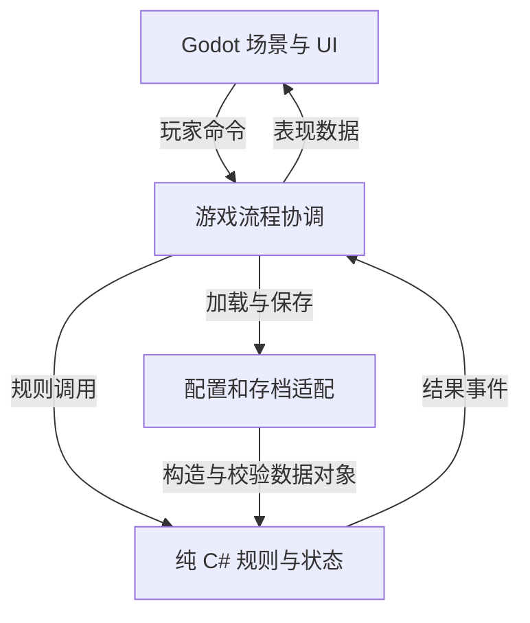

# 技术选型与架构

> 状态：技术方向已记录，实施细节待原型验证 ｜ 负责人：待填写 ｜ 更新日期：2026-10-08 ｜ 对应版本：待填写 ｜ 实现与验证：未进行

采用 **Godot 4 稳定版（.NET）+ C#**，以独立规则层承载属性、装备、卡组与战斗结算，Godot 负责场景、输入、渲染和界面。选型重点是规则正确性、关卡制作效率及探索状态一致性。

[返回游戏概览](../00_游戏概览.md)

本轮按用户要求记录此前推荐的引擎与技术组合。**Windows PC 本地单人原型是验证前提，正式首发平台、联网方式、团队规模与预算仍待确认。** 俯视角移动、独立战斗场景及地形记忆等玩法仍按各自草案管理，本页不代替玩法决策。

## 选型依据与代价

现有设计需要装备驱动卡组、大量规则配置与界面交互，也需要多区域箱庭及墙、门、拐角的视野遮挡。Godot 的专用 2D 工作流、地图编辑器、场景组合和 UI 系统适合这些需求；C# 便于将规则整理为可重构、可独立测试的代码库。选择 C# 的主要依据是规则维护与验证便利，不预设性能瓶颈。

| 候选组合 | 当前取舍 | 重新评估条件 |
| --- | --- | --- |
| Godot 4 .NET + C# | 采用；接受额外的 .NET 环境配置与平台限制 | 原型发现关键工具或导出能力不满足需求 |
| Godot + 类型化 GDScript | Web 首发或更重视引擎内脚本迭代时的备选 | 首发平台改为浏览器 |
| Unity + C# | 已有 Unity 团队经验或资产积累时的备选，可采用 URP 2D | 移动端优先、平台接入或团队经验改变选型收益 |
| Unreal、Qt/C++ 自建方案 | 当前不选；现有需求不足以支持额外工作流或基础设施投入 | 产品形态出现实质变化 |

截至本次记录，Godot 官方仍注明 Godot 4 的 C# 项目无法导出 Web，Android/iOS 支持为实验性。**桌面原型通过不等于移动端已验证，也不代表已经具备多人同步能力。** 平台改变时重新检查官方支持与实际导出结果。

## 技术组合

| 模块 | 技术选择 | 职责与边界 |
| --- | --- | --- |
| 引擎与语言 | Godot 4 稳定版 .NET + C# | 场景、输入、2D 渲染与客户端实现；准确版本在环境验证后锁定 |
| 核心规则 | 不依赖 Godot 节点或 Godot 类型的纯 C# 类库 | 属性、穿戴校验、装备供牌及战斗结算 |
| 战斗执行 | 显式状态机、命令处理、有序效果队列 | 回合阶段、合法性校验、效果触发与结果事件 |
| 地图制作 | TileMapLayer + 可复用场景 | 地形、墙、门、宝箱、入口与机关；不用旧 TileMap 作为新项目基础 |
| 区域管理 | 区域连接图 + 按区域加载 | 通过稳定 ID 恢复区域状态，控制同时加载的范围 |
| 视野 | 独立可见性计算 + 迷雾着色器 | 可见性服务统一控制显示与交互，灯光负责视觉表现 |
| UI 与动画 | Control、Container、Theme 及原生动画系统 | 手牌、背包、装备比较、提示和结果反馈 |
| 内容配置 | JSON + 强类型数据对象 | 规则配置唯一来源；Godot Resource 负责图像、音频和场景引用 |
| 存档 | 带版本号的 JSON + System.Text.Json | 持久状态序列化、临时写入、备份与迁移 |
| 验证 | xUnit + 无界面规则模拟器 | 独立验证规则、固定条件复现、批量平衡模拟 |
| 工程工具 | VS Code + C# 扩展；Git，按需 Git LFS | 编辑与调试、版本管理；已有 Visual Studio 或 Rider 可继续使用 |

配置与存档细则分别见[数据结构与配置管理](02_数据结构与配置管理.md)、[存档读档与版本兼容](04_存档读档与版本兼容.md)。安装组件和版本登记见[性能平台与发布构建](05_性能平台与发布构建.md)。

## 模块职责与依赖

采用“规则、流程协调、表现、基础设施”分层。以下名称是模块职责，不要求首轮就拆成多个进程或复杂框架。

- **规则层**持有权威状态，执行合法性检查和结算，不调用场景树、动画或文件系统。配置模板只读，角色、装备和战斗实例分别持有可变状态。
- **流程协调层**处理区域加载、探索／战斗交接、输入锁定及保存时机。若采用独立战斗场景草案，由此层冻结地图并恢复场景，不让战斗界面直接修改地图进度。
- **表现层**读取状态与结果事件，维护选中、悬停、布局和动画进度；这些界面状态不决定战斗结果。
- **基础设施**负责 JSON、资源 ID 映射、文件写入和诊断日志。配置校验失败时阻止进入依赖该配置的流程，报告文件、ID 与字段，不能静默跳过规则。

一次出牌的数据流为：**提交命令 → 校验阶段、费用和目标 → 按规则扣费并结算效果 → 生成有序结果事件 → 界面播放反馈**。动画加速或跳过应得到相同的最终状态；详细执行与复现约束见[战斗实现与调试工具](03_战斗实现与调试工具.md)。

## 视野与区域实现边界

[有限视野与遮挡](../06_世界与关卡/06_视野遮挡与箱庭探索机制.md)已确认。统一可见性结果用于敌人、物品、名称、悬停、目标选择和交互提示；遮挡后的对象不能仅靠画面变暗来隐藏。分别表达“可通行”和“可透视”，房门状态变化同时更新对应碰撞、遮挡与相关路径信息。

视野计算算法、网格精度、更新频率和边缘过渡宽度待小区域验证，不能仅因使用瓦片地图就决定角色必须格子移动。若采用地形记忆草案，则另外记录已见区域和上次观察信息；读档根据位置、楼层和门状态重算当前视野，不能把旧动态可见性恢复为实时信息。

区域场景负责可视和碰撞资源，区域持久状态按 ID 独立保存。区域切换不应隐式重置门、宝箱或敌人；哪些对象可刷新仍由玩法规则确定。

## 实施顺序与验收

1. 配置 .NET 开发环境，建立 Godot 客户端及独立 C# 规则项目，验证编译、运行和 Windows 导出。
2. 用少量装备与卡牌打通穿戴校验、供牌、抽牌和费用结算，并补齐影响执行顺序的玩法决定。
3. 制作包含关闭房门、L 形走廊和遮挡对象的小区域，检查显示、交互与视野的一致性。
4. 若采用当前探索草案，加入一条捷径、一次遭遇、一次换装与存读档，验证完整往返后再扩展内容。

| 验收重点 | 预期结果 | 状态 |
| --- | --- | --- |
| 无界面执行 | 不启动 Godot，独立运行规则测试和模拟 | 未验证 |
| 表现与规则分离 | 正常播放、加速或跳过动画，规则结果一致 | 未验证 |
| 遮挡一致性 | 关门、贴墙转角和悬停均不泄露遮挡后的对象 | 未验证 |
| 状态恢复 | 存档恢复后装备供牌正确；若采用地形记忆，仅重算当前位置的实时视野 | 未验证 |
| 独立导出 | 导出的 Windows 游戏能够在无开发环境的测试设备启动 | 未验证 |

## 待定事项与来源

正式首发平台、联网方式、最低设备、团队技术经验、性能指标和准确依赖版本待确认。角色人数、速度排序、回合开始触发顺序及战斗中存档等玩法细节仍由相关模块决定。上述验收均为计划，不代表已经安装、实现或测得性能结果。

官方资料核对日期：2026-10-08。项目适配与取舍是本方案判断。

- [Godot 功能与许可](https://godotengine.org/features/)：2D、地图、UI、Resource 与 MIT 许可。
- [Godot C# 环境与平台限制](https://docs.godotengine.org/en/stable/tutorials/scripting/c_sharp/c_sharp_basics.html)。
- [TileMapLayer](https://docs.godotengine.org/en/stable/classes/class_tilemaplayer.html)：新项目使用的瓦片地图节点。
- [Unity URP 2D](https://docs.unity3d.com/6000.0/Documentation/Manual/urp/2d-index.html)：备选方案的 2D 工作流。
